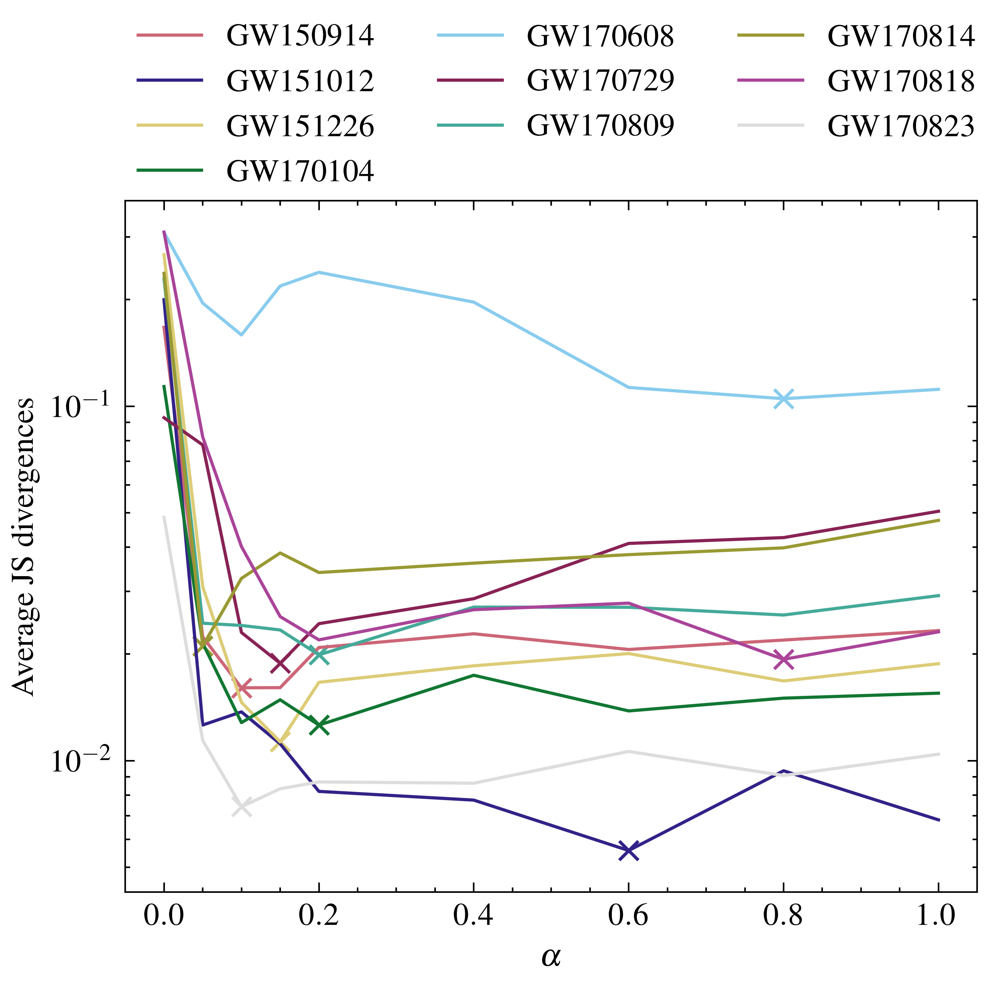
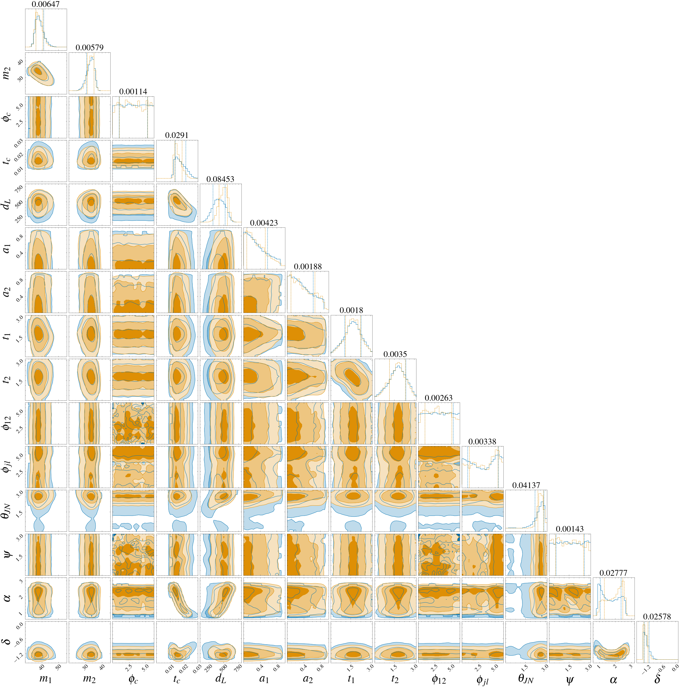

>The project was originally forked from the **lfigw** project. It is licensed under the MIT License.
>Our work was inspired and developed upon the research in **"Complete parameter inference for GW150914 using deep learning"** by Stephen R. Green et al.
>Please visit [https://github.com/stephengreen/lfi-gw](https://github.com/stephengreen/lfi-gw) or the [paper](https://iopscience.iop.org/article/10.1088/2632-2153/abfaed) by Stephen R. Green and Jonathan Gair for further details and contributions.

---

# Sampling with Prior Knowledge for High-dimensional Gravitational-wave Data Analysis


**He Wang <sup>1</sup>, Zhoujian Cao<sup>2</sup>, Yue Zhou<sup>3</sup>, Zong-Kuan Guo<sup>1</sup>, Zhixiang Ren*<sup>3</sup>**

<sub>1. Institute of Theoretical Physics, Chinese Academy of Sciences, Beijing, China</sub>  
<sub>2. Department of Astronomy, Beijing Normal University, Beijing, China</sub>  
<sub>3. Research Center for AI, Peng Cheng Laboratory, Shenzhen, China</sub>


[]() [](https://ieeexplore.ieee.org/abstract/document/9663260/) 


## Introduction

Extracting knowledge from high-dimensional data has been notoriously difficult, mainly due to the so-called "curse of dimensionality" and the complex joint distributions of the dimensions.
This is a particularly profound issue for 24,096-dimensional gravitational-wave data analysis, where one needs to conduct Bayesian inference and estimate the joint posterior distributions.
In this work, we incorporate physical prior knowledge by sampling from desired interim distributions and construct the training dataset.
In practice, we draw the training samples from the interim distribution with a certain probability _alpha_ and also from an evenly distributed set with a probability _1-\alpha_.
Accordingly, the more relevant regions in the high-dimensional feature space are covered by data points so that the model can learn the subtle but critical details.
We also adapt the normalizing flow method to be more expressive and trainable so that the information can be extracted and represented effectively by the transformation between the prior and target distributions.
The evaluation of our approach verifies the efficacy and efficiency for gravitational-wave data inference and points to a promising direction for similar research.

The paper is available on [*Big Data Mining and Analytics*](https://ieeexplore.ieee.org/abstract/document/9663260/). This release contains scripts and data files of the research.


## Setup

Create and activate a conda environment with the correct software dependencies:

```shell
conda env create -f environment.yml
conda activate env
```

## Usage

1. Download data (optional).

    I have already download and pre-processing the strain data for GWTC-1 as in `./data`. 
    And one can download the samples data of domain knowledge from [Bilby GWTC-1](https://bilby-gwtc1.github.io/) in `downsampled_posterior_samples_v1.0.0`.

2. Generate the reduced-order representation.

    Use `prepreparing4RBasis.py` to generate reduced-order representation for each BBH events in GWTC-1.
    Use `test4RBasis.py` to test the reduced performance.

3. Train the network.

    ```shell
    ./run.sh        # alpha=0 or 1
    ./run_alpha.sh  # 0 < alpha < 1
    ```

Network hyperparameters and training options can be specified by modifying this script.

## Inference

To perform inference, execute the code in `evaluate_PCL_test_sh.py` or `evaluate_PCL_test_whentrain.py`
This loads the strain data for each BBH events in GWTC-1 and conditions the trained normalizing flow on them. 
It draws samples from the base space, and applies the flow to generate samples from the conditional density estimator.

## Results

<br/>

To quantitatively measure the prior sampling effect on $\alpha$, we show the mean JS divergence of the complete 15 parameters on various prior sampling probability _alpha_ for 10 real gravitational-wave events. 
Intuitively, the _alpha_ represents the domain knowledge used in the construction of training dataset. 
The cross mark shows the saturation position of _alpha_ and the effect is discussed in the main text.
The downward trends in JS divergence for all distinct events show a saturation effect on _alpha_ around 0.1.
This implies that roughly 10% physical prior knowledge incorporated is enough for accurate Bayesian inference of the high-dimensional gravitational-wave data.

The resulting posterior distributions for GW150914 can be compared, and we see that they are indistinguishable, both qualitatively and quantitatively, with the ground truth:

<br/>

Marginalized one- (1-sigma) and two- dimensional posterior distributions for the benchmarking event (GW150914) over the complete 15 physical parameters, with our approach (orange) and the ground truth (blue). 
The JS divergences are showed on the top and the contours represent 1-, 2- and 3-sigma significance level.

## License and Citation

Copyright (c) 2020 Stephen Green

Copyright (c) 2021 Peng Cheng Laboratory.

Licensed under the MIT license. For copyright information, consult the LICENSE file.

